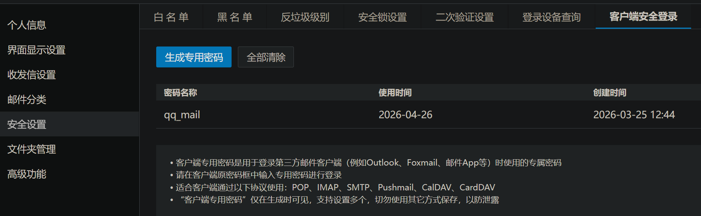
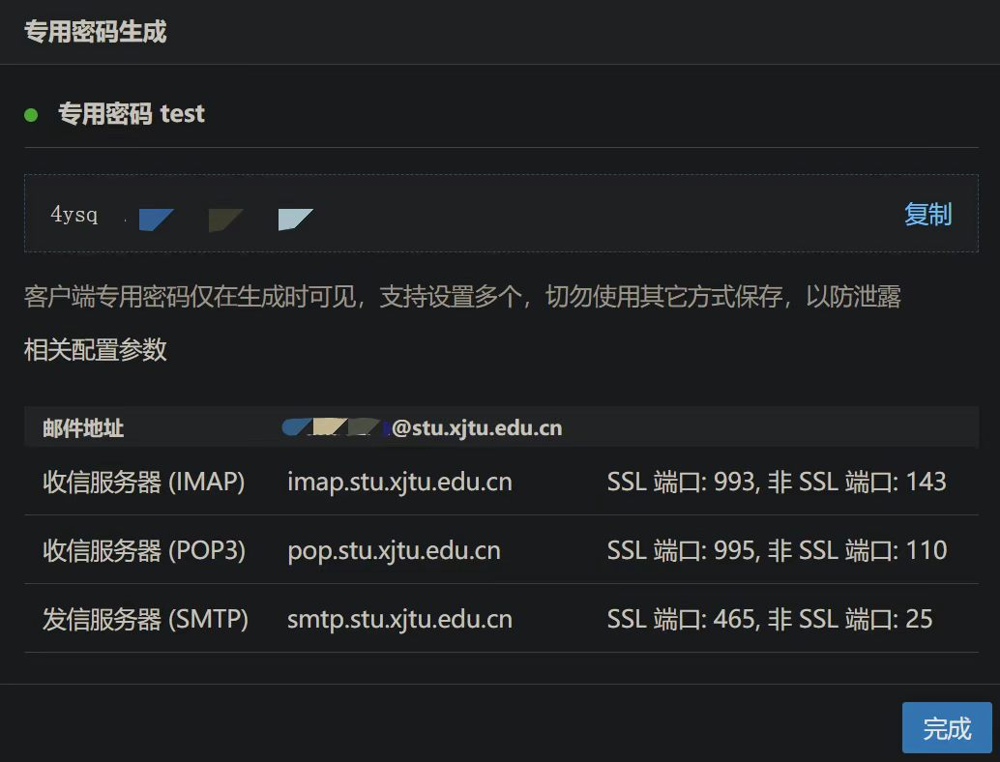
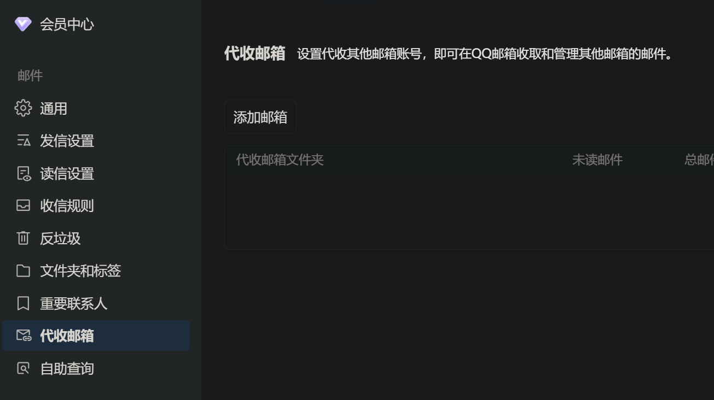
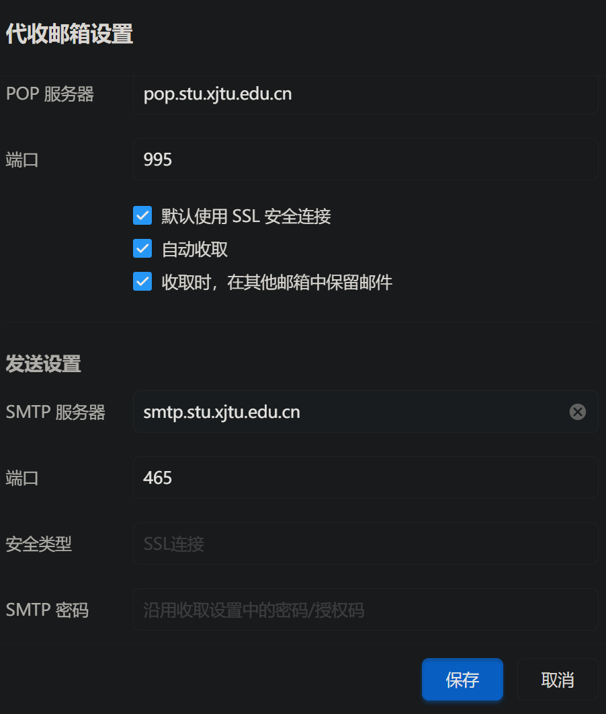
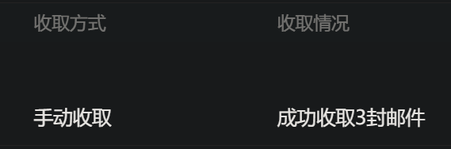
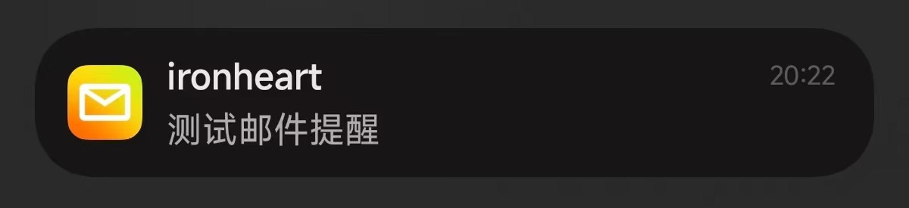

# 邮差请按门铃

你是否有过以下经历：联系方式填写了学校邮箱，但由于学校邮箱没有主动提醒的功能从而错过邮件。针对这一问题，可以通过设置代收邮箱解决。

> **邮件传输协议**
>
> 电子邮件需要在邮件客户端和邮件服务器之间，以及两个邮件服务器之间进行传递，就必须遵循一定的规则，这些规则就是邮件传输协议。SMTP协议定了邮件客户端与SMTP服务之间，以及两台SMTP服务器之间发送邮件的通信规则；POP3/IMAP协议定义了邮件客户端与POP3服务器之间收发邮件的通信规则。简单来说，发送一封邮件会经过以下步骤：
>
> ```mermaid
> graph LR
>     A(发件方客户端) -->|SMTP| B(发件方服务器)
>     B -->|SMTP| C(收件方服务器)
>     C -->|POP3/IMAP| D(收件方客户端)
> ```

我们的目标是让具有主动提醒能力客户端的邮箱（如QQ邮箱、163邮箱）代收学校邮箱，从而实现学校邮箱邮件的主动提醒。以下以QQ邮箱为例。

## 获取学校邮箱第三方客户端专用密码

西安交通大学邮箱对第三方客户端使用专用密码登录，在设置代收之前，需要先获取专用密码。

登录学校邮箱，选择`设置->安全设置->客户端安全登录`​ ，点击`生成专用密码` ，密码名称自拟。



随后便可获得专用密码和邮件地址。注意，专用密码仅在生成时可见，注意保存。



## 设置代收邮箱

登录QQ邮箱，选择`设置->代收邮箱`​ ，点击`添加邮箱` ，填写需要代收的邮箱，此处为学校邮箱，点击下一步，填写之前获取的专用密码，点击添加。此时应显示添加成功，建议暂时不收取邮件。



## 设置SSL

邮件默认以明文传输，为保护隐私，可设置SSL端口。找到已添加的代收邮箱，点击设置，将此前获得的邮件地址填入对应位置。注意，QQ邮箱使用POP协议代收邮件，因此需要填写POP协议的地址，同时勾选SSL安全连接，点击保存。



此时可以查看收取情况。



## 接收邮件提醒

使用QQ邮箱手机客户端或者开启微信的邮箱提醒功能，即可收到学校邮箱的邮件提醒。勾选了自动收取邮件的情况下，QQ邮箱会每小时收取一次邮件，基本上可以保证不会错过邮件。



## FAQ

> 为什么选择QQ邮箱作为示例？

QQ邮箱与腾讯系软件绑定，如果不想额外下载手机邮箱客户端，可以直接使用微信或QQ的邮件提醒，通知方式多样，体验优良。

> 为什么选择让邮箱服务端代收邮件而不是直接使用客户端收取邮件？

如果使用客户端收取邮件，可能会因为客户端被杀后台等等原因导致邮件收取不及时。让邮箱服务端代收邮件，可以确保邮件及时收取。此外，如果有多个邮箱需要收取，在更换设备或重装软件后无需针对每个邮箱重新配置收件信息，只需登录一个邮箱即可保留所有代收信息。
